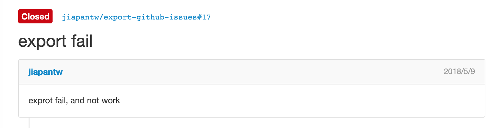

# export-github-issues

[](http://standardjs.com/)

_Get your GitHub Issues offline! In Markdown and HTML._

This is a command line application, using [Node.js](http://nodejs.org/), that fetches the GitHub Issue/s you specify and writes them to files on your computer in both HTML and markdown formats. This way you can view them without an internet connection.

**This will cap issues at the first 250.**



## Usage

> Use it to save Issues as `.md` and `.html`. Options in next section.

- install

```sh
npm install -g @jiapantw/export-github-issues
```

> github_api_token, you can to github generate api_token for temp

- For one issue:

```bash
export-github-issues --token <github_api_token> <ownerId>/<repo>#issueId
```

- For all issues:

```bash
export-github-issues --token <github_api_token> <ownerId>/<repo>
```

- For multiple repositories or issues:

```bash
export-github-issues --token <github_api_token> <ownerId>/<repo> <ownerId>/<repo2>#1
```

**Example:**

```bash
export-github-issues --token <github_api_token> justintien/blog#1 justintien/blog#2
```

The files are written to whichever directory you are currently in. You will see a `md` and `html` folder added, each of which contains the issues you requested.

## Options

To just generate HTML files from existing offline cache:

```bash
export-github-issues -h
export-github-issues --html
```

To skip generating ./static/* files for HTML:

```bash
export-github-issues -S <ownerId>/<repo>
export-github-issues --no-static <ownerId>/<repo>
```

To save generated files in different location:

```bash
export-github-issues -d <DIRECTORY> <ownerId>/<repo>
export-github-issues --destination <DIRECTORY> <ownerId>/<repo>
```

To filter by issue state:

```bash
export-github-issues -s all <ownerId>/<repo>
export-github-issues --state all <ownerId>/<repo>
```

This option accepts either ```open```, ```closed``` or ```all```. (Default: ```all```)
Note that the filter won't be applied when issue number is specified, like ```muan/github-gmail#4```.
